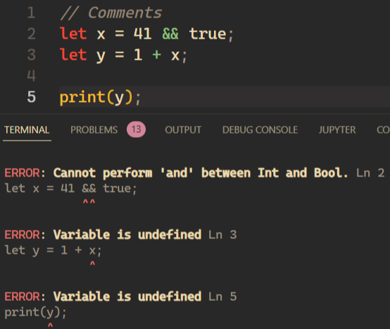
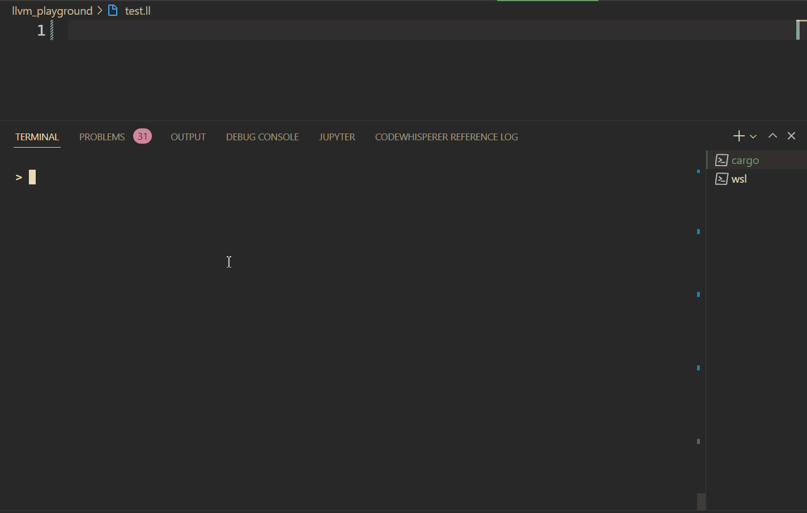

# Rust Sharp

A small compiler I am working on to learn more about Rust, Compilers, LLVM and mostly have fun.

## Rust Sharp?

Very deep lore easter egg reference to [PoSharp](https://github.com/pijuskri/Po-Sharp).

## What is the Focus of this Project?

Although I am interested in both Compilers and languages somewhat, I am not qualified
enough in any way to make something even remotely useful (or usable even). My only experience
with (an interpreted) language design is a university course which I just barely passed.

This plus the fact that I don't have a specific use case for this language means that I will
most likely not focus too much on the language itself but rather on some accompanying utility
that would come with a language.

I want to experiment with syntax highlighting, nice and helpful error messages, perhaps some
interoperability with PoSharp and maybe even a language server.

Now that I got the fact that you really shouldn't take this project seriously as a learning
or a good practice resource, I'll showcase some of the stuff currently present in the language.

Also worth mentioning that I decided to not use any dependencies except for a Parser Generator
called [LALRPOP](https://github.com/lalrpop/lalrpop) as I would rather do most stuff myself
rather than accelerate the development process since I don't care as much about the end result
anyways.

### Features

Right now the idea is to create a simple, statically typed language with numeric and boolean
primitives. In the future, I might add control flow stuff (ifs, fors etc) but for now, I want
to keep stuff simple.

As of writing this, the only thing fully implemented is basically the following: 

```rust
// Comments
let x = 41;
let y = 1 + x; // Nested expressions don't work yet

// Printing
print(y); // 42
```

Basic arithmetic isn't yet fully implemented (only addition works so far) and neither
are booleans. Right now, the main bottle-kneck is my non-existent knowledge of the LLVM 
Intermediate Language + deciding when to stop refactoring my code.

### Error messages

One of the main goals of this project is to experiment a lot with error reporting (and later
on perhaps even provide suggestions for fixing them through a language server).

<div align="center">
  
</div>

### Syntax Highlighting

As you may have noticed from the previous image, I am also working on syntax highlighting.
Right now I'm working on a Visual Studio Code extension (the `rustsharp` folder) which you can
try out locally by running `UpdateHighlighting.ps1` (if you're not on windows just read the file,
it's 2 lines long).

### REPL

I think that one of the interesting ideas is the Read Evaluate Program Loop which instead of
interpreting as you'd probably expect, actually gives you back (hopefully) valid LLVM IR.
This should in theory work properly incrementally and you can see it working here

<div align="center">
  
</div>

## Running Locally

The compiler is a plain old [Rust](https://www.rust-lang.org/tools/install) project. Just
running `cargo run` will probably spin up the REPL. I say probably because I also set it up
so it can read code from [this](./samples/test.rsharp) code file and I just toggle comment
the last line in my [main](./src/main.rs) file.

To actually run the generated IR, you need [WSL](https://docs.microsoft.com/en-us/windows/wsl/install) 
(if on windows) as well as [LLVM](https://llvm.org/) installed.

I remember having some issues getting the LLVM compiler to work locally, I think in the end
running `sudo apt-get install llvm` solved it but not sure. If you are having issues with this
open an issue and I'll try to help.

The compiler itself doesn't currently output the IR anywhere so I just copy paste it to
[this](./llvm_playground/test.ll) file. I also have a small `run` script in the folder
to compile and execute it.

## Inspiration

In the end, the code ended up being mostly mine (evident by how bad it is) for the most part 
but a few people helped me get started on the project or gave me some ideas
through the content they created and I wanted to mention them;

- Seán Kelleher's [Writing a Programming Language](https://www.youtube.com/playlist?list=PLkpGh2gaaueyzEAn07jf44LdscDeWRyzy)
- Immo Landwerth's [Building a Compiler](https://youtube.com/playlist?list=PLRAdsfhKI4OWNOSfS7EUu5GRAVmze1t2y)
- [Casey Muratori](https://caseymuratori.com/about) and 
  [Jonathan Blow](https://www.youtube.com/user/jblow888/featured) who both made me want to leap out
  of my comfort zone and try a different aspect of programming.

I will perhaps blog about this at some point.
